# Auto Import from Banks - Concept Flow (EnableBanking)

```mermaid
flowchart TD
    Start([User Initiates Auto Import]) --> CheckAuth{User Authenticated?}
    
    CheckAuth -->|No| LoginFlow[Redirect to Login]
    LoginFlow --> AuthSuccess[User Authenticated]
    
    CheckAuth -->|Yes| AuthSuccess
    
    AuthSuccess --> SelectBank[User Selects Bank & Country]
    SelectBank --> ConnectBank[Start EnableBanking Flow]
    
    ConnectBank --> GenJWT[Generate JWT with Private Key]
    GenJWT --> AuthReq[Start Authorization Request]
    AuthReq --> UserBankAuth[User Completes Bank Login<br/>in Browser]
    
    UserBankAuth --> AuthCallback[Authorization Callback<br/>Returns Auth Code]
    AuthCallback --> SessionCreate[Create Session with Auth Code]
    SessionCreate --> SessionResp[Receive Session ID +<br/>Account Resources]
    
    SessionResp --> StoreSession[Store Session ID &<br/>Account Mapping in DB]
    
    StoreSession --> FetchBalances[Fetch Account Balances<br/>via EnableBanking API]
    FetchBalances --> FetchTransactions[Fetch Transactions<br/>via EnableBanking API]
    
    FetchTransactions --> ParseTx[Parse & Transform<br/>Transaction Data]
    ParseTx --> MapCategories{Auto-Categorize<br/>Transactions?}
    
    MapCategories -->|Yes| AutoCat[Apply ML/Rule-Based<br/>Category Matching]
    AutoCat --> CategoryMapped[Transactions with<br/>Categories Assigned]
    
    MapCategories -->|No| CategoryMapped
    
    CategoryMapped --> ValidateTx[Validate Transactions<br/>Against Rules]
    ValidateTx --> DedupeCheck{Deduplicate<br/>Check}
    
    DedupeCheck -->|Already Exists| SkipTx[Skip Duplicate]
    DedupeCheck -->|New| StoreTx[Store in DB]
    
    SkipTx --> BulkImport
    StoreTx --> BulkImport[Bulk Import Transactions]
    
    BulkImport --> UpdateBalance[Update Account Balance<br/>from API Response]
    UpdateBalance --> NotifyUser[Notify User of<br/>Import Success]
    
    NotifyUser --> ScheduleRefresh[Schedule Next Auto-Import<br/>Interval Timer]
    ScheduleRefresh --> WaitInterval[Wait for Next Interval<br/>e.g., Daily/Weekly]
    
    WaitInterval --> RefreshSession{Session Still<br/>Valid?}
    
    RefreshSession -->|Yes| FetchTransactions
    RefreshSession -->|No| ReAuth[User Re-authorizes<br/>via New Flow]
    ReAuth --> FetchTransactions
    
    ReAuth -.->|Error| AuthFailed[Notify User:<br/>Auth Required]
    AuthFailed --> End([End])
    
    NotifyUser --> End

    style Start fill:#90EE90
    style End fill:#FFB6C6
    style UserBankAuth fill:#FFE4B5
    style FetchBalances fill:#87CEEB
    style FetchTransactions fill:#87CEEB
    style StoreTx fill:#DDA0DD
    style NotifyUser fill:#F0E68C
    style ScheduleRefresh fill:#B0C4DE
```

## Key Components Explained:

### 1. **Authentication Phase**
   - User must be logged into the application
   - JWT token available for API calls

### 2. **Bank Selection & Authorization**
   - User selects bank and country
   - EnableBanking generates authorization URL
   - User logs into their bank in a browser window
   - OAuth2 callback returns authorization code

### 3. **Session Management**
   - Exchange auth code for EnableBanking session
   - Session ID tied to user account for future API calls
   - Store session metadata in DB for recurring imports

### 4. **Data Fetching**
   - Fetch account balances via EnableBanking API
   - Fetch transactions within configurable date range
   - Handle pagination for large transaction sets

### 5. **Data Processing**
   - Parse and transform transaction data
   - Optional auto-categorization (rule-based or ML)
   - Validate against business rules
   - Deduplicate against existing transactions

### 6. **Persistence**
   - Bulk insert new transactions into database
   - Update account balance
   - Create audit log entries

### 7. **Recurring Import Scheduling**
   - After initial import, schedule next run (daily/weekly)
   - Use background job service (e.g., hosted service)
   - Check session validity before each run
   - Refresh session if expired (may require user re-auth)

## Implementation Considerations:

- **Session Storage**: Store `SessionId` + `AccountUid` mapping in a new `ImportedAccount` or `BankConnection` table
- **Deduplication**: Use combination of `Date`, `Amount`, `Description`, and `AccountId` as unique key
- **Error Handling**: Graceful fallback if API rate limits or temporary errors occur
- **Security**: Never store Enable Banking credentials—only session IDs
- **Background Job**: Leverage ASP.NET Core Hosted Service (like `ScheduledTransactionProcessor`)
- **Webhook Support**: Optional—Enable Banking can push transactions via webhooks instead of polling
